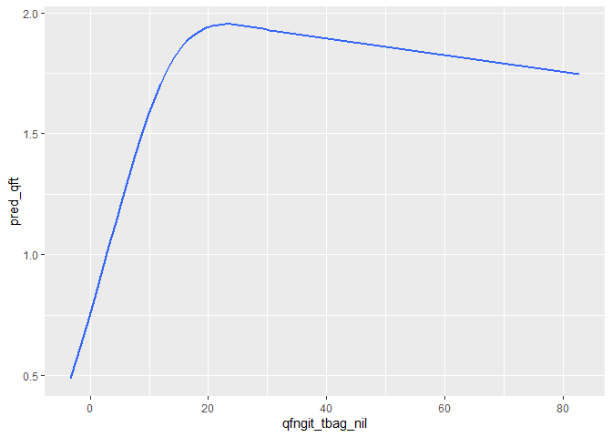
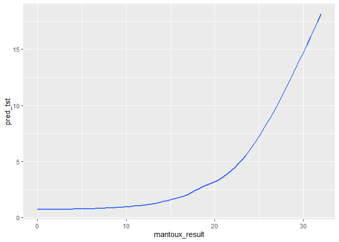
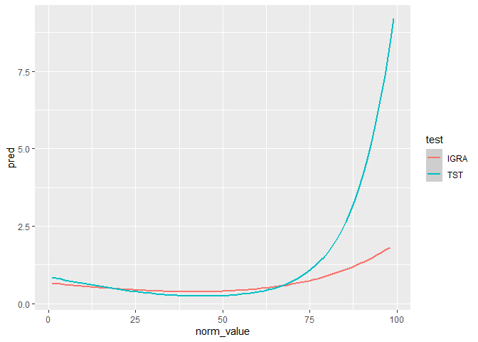

ACS data anaysis
================

Characteristics of participants

    ## [1] "<table class=\"Rtable1\">\n<thead>\n<tr>\n<th class='rowlabel firstrow lastrow'></th>\n<th class='firstrow lastrow'>Overall (N=6321)</th>\n</tr>\n</thead>\n<tbody>\n<tr>\n<td class='rowlabel firstrow'>activetb</td>\n<td class='firstrow'></td>\n</tr>\n<tr>\n<td class='rowlabel'>no</td>\n<td>6234 (98.6%)</td>\n</tr>\n<tr>\n<td class='rowlabel lastrow'>yes</td>\n<td class='lastrow'>87 (1.4%)</td>\n</tr>\n<tr>\n<td class='rowlabel firstrow'>mantoux_bin</td>\n<td class='firstrow'></td>\n</tr>\n<tr>\n<td class='rowlabel'>negative</td>\n<td>2538 (40.2%)</td>\n</tr>\n<tr>\n<td class='rowlabel'>positive</td>\n<td>3091 (48.9%)</td>\n</tr>\n<tr>\n<td class='rowlabel lastrow'>Missing</td>\n<td class='lastrow'>692 (10.9%)</td>\n</tr>\n<tr>\n<td class='rowlabel firstrow'>mantoux_result</td>\n<td class='firstrow'></td>\n</tr>\n<tr>\n<td class='rowlabel'>Mean (SD)</td>\n<td>7.09 (7.02)</td>\n</tr>\n<tr>\n<td class='rowlabel'>Median [Min, Max]</td>\n<td>8.00 [0, 32.0]</td>\n</tr>\n<tr>\n<td class='rowlabel lastrow'>Missing</td>\n<td class='lastrow'>692 (10.9%)</td>\n</tr>\n<tr>\n<td class='rowlabel firstrow'>igrapos</td>\n<td class='firstrow'></td>\n</tr>\n<tr>\n<td class='rowlabel'>negative</td>\n<td>2791 (44.2%)</td>\n</tr>\n<tr>\n<td class='rowlabel'>positive</td>\n<td>3210 (50.8%)</td>\n</tr>\n<tr>\n<td class='rowlabel lastrow'>Missing</td>\n<td class='lastrow'>320 (5.1%)</td>\n</tr>\n<tr>\n<td class='rowlabel firstrow'>qfngit_tbag_nil</td>\n<td class='firstrow'></td>\n</tr>\n<tr>\n<td class='rowlabel'>Mean (SD)</td>\n<td>6.43 (11.5)</td>\n</tr>\n<tr>\n<td class='rowlabel'>Median [Min, Max]</td>\n<td>0.550 [-3.34, 82.9]</td>\n</tr>\n<tr>\n<td class='rowlabel lastrow'>Missing</td>\n<td class='lastrow'>320 (5.1%)</td>\n</tr>\n<tr>\n<td class='rowlabel firstrow'>contact</td>\n<td class='firstrow'></td>\n</tr>\n<tr>\n<td class='rowlabel'>no</td>\n<td>4728 (74.8%)</td>\n</tr>\n<tr>\n<td class='rowlabel'>yes</td>\n<td>1583 (25.0%)</td>\n</tr>\n<tr>\n<td class='rowlabel lastrow'>Missing</td>\n<td class='lastrow'>10 (0.2%)</td>\n</tr>\n<tr>\n<td class='rowlabel firstrow'>age</td>\n<td class='firstrow'></td>\n</tr>\n<tr>\n<td class='rowlabel'>Mean (SD)</td>\n<td>15.2 (1.50)</td>\n</tr>\n<tr>\n<td class='rowlabel lastrow'>Median [Min, Max]</td>\n<td class='lastrow'>15.0 [12.0, 18.0]</td>\n</tr>\n<tr>\n<td class='rowlabel firstrow'>sex</td>\n<td class='firstrow'></td>\n</tr>\n<tr>\n<td class='rowlabel'>male</td>\n<td>2892 (45.8%)</td>\n</tr>\n<tr>\n<td class='rowlabel lastrow'>female</td>\n<td class='lastrow'>3429 (54.2%)</td>\n</tr>\n<tr>\n<td class='rowlabel firstrow'>prevtbdiag</td>\n<td class='firstrow'></td>\n</tr>\n<tr>\n<td class='rowlabel'>no</td>\n<td>5671 (89.7%)</td>\n</tr>\n<tr>\n<td class='rowlabel'>yes</td>\n<td>635 (10.0%)</td>\n</tr>\n<tr>\n<td class='rowlabel lastrow'>Missing</td>\n<td class='lastrow'>15 (0.2%)</td>\n</tr>\n<tr>\n<td class='rowlabel firstrow'>prevbcg</td>\n<td class='firstrow'></td>\n</tr>\n<tr>\n<td class='rowlabel'>no</td>\n<td>56 (0.9%)</td>\n</tr>\n<tr>\n<td class='rowlabel'>yes</td>\n<td>5943 (94.0%)</td>\n</tr>\n<tr>\n<td class='rowlabel lastrow'>Missing</td>\n<td class='lastrow'>322 (5.1%)</td>\n</tr>\n<tr>\n<td class='rowlabel firstrow'>bmi</td>\n<td class='firstrow'></td>\n</tr>\n<tr>\n<td class='rowlabel'>Mean (SD)</td>\n<td>21.0 (4.06)</td>\n</tr>\n<tr>\n<td class='rowlabel lastrow'>Median [Min, Max]</td>\n<td class='lastrow'>20.1 [12.5, 56.8]</td>\n</tr>\n<tr>\n<td class='rowlabel firstrow'>MotherGrossMonthlyIncome</td>\n<td class='firstrow'></td>\n</tr>\n<tr>\n<td class='rowlabel'>>R4000</td>\n<td>540 (8.5%)</td>\n</tr>\n<tr>\n<td class='rowlabel'>1-R1000</td>\n<td>1512 (23.9%)</td>\n</tr>\n<tr>\n<td class='rowlabel'>none</td>\n<td>1753 (27.7%)</td>\n</tr>\n<tr>\n<td class='rowlabel'>R1001-R4000</td>\n<td>1502 (23.8%)</td>\n</tr>\n<tr>\n<td class='rowlabel lastrow'>Missing</td>\n<td class='lastrow'>1014 (16.0%)</td>\n</tr>\n<tr>\n<td class='rowlabel firstrow'>FatherGrossMonthlyIncome</td>\n<td class='firstrow'></td>\n</tr>\n<tr>\n<td class='rowlabel'>>R4000</td>\n<td>769 (12.2%)</td>\n</tr>\n<tr>\n<td class='rowlabel'>1-R1000</td>\n<td>592 (9.4%)</td>\n</tr>\n<tr>\n<td class='rowlabel'>none</td>\n<td>247 (3.9%)</td>\n</tr>\n<tr>\n<td class='rowlabel'>R1001-R4000</td>\n<td>1209 (19.1%)</td>\n</tr>\n<tr>\n<td class='rowlabel lastrow'>Missing</td>\n<td class='lastrow'>3504 (55.4%)</td>\n</tr>\n<tr>\n<td class='rowlabel firstrow'>GuardianGrossMonthlyIncome</td>\n<td class='firstrow'></td>\n</tr>\n<tr>\n<td class='rowlabel'>>R4000</td>\n<td>32 (0.5%)</td>\n</tr>\n<tr>\n<td class='rowlabel'>1-R1000</td>\n<td>265 (4.2%)</td>\n</tr>\n<tr>\n<td class='rowlabel'>none</td>\n<td>279 (4.4%)</td>\n</tr>\n<tr>\n<td class='rowlabel'>R1001-R4000</td>\n<td>136 (2.2%)</td>\n</tr>\n<tr>\n<td class='rowlabel lastrow'>Missing</td>\n<td class='lastrow'>5609 (88.7%)</td>\n</tr>\n<tr>\n<td class='rowlabel firstrow'>followup</td>\n<td class='firstrow'></td>\n</tr>\n<tr>\n<td class='rowlabel'>Mean (SD)</td>\n<td>652 (186)</td>\n</tr>\n<tr>\n<td class='rowlabel lastrow'>Median [Min, Max]</td>\n<td class='lastrow'>721 [1.00, 1130]</td>\n</tr>\n</tbody>\n</table>\n"

# Missing data

<!-- --><!-- -->

    ## 
    ##  Variables sorted by number of missings: 
    ##                  Variable       Count
    ##  MotherGrossMonthlyIncome 0.160417655
    ##               mantoux_bin 0.109476349
    ##                   prevbcg 0.050941307
    ##                   igrapos 0.050624901
    ##                prevtbdiag 0.002373042
    ##                   contact 0.001582028
    ##                  activetb 0.000000000
    ##                       age 0.000000000
    ##                       sex 0.000000000
    ##                       bmi 0.000000000
    ##                  followup 0.000000000

Overall incidence rate 0.77 per 100p-y

    ## # A tibble: 3 x 4
    ##   mantoux_bin activetb followup    ir
    ##   <fct>          <dbl>    <dbl> <dbl>
    ## 1 negative          22  1646287 0.488
    ## 2 positive          51  2017753 0.923
    ## 3 <NA>              14   459154 1.11

    ## # A tibble: 3 x 4
    ##   igrapos  activetb followup    ir
    ##   <fct>       <dbl>    <dbl> <dbl>
    ## 1 negative       27  1802058 0.547
    ## 2 positive       57  2105552 0.988
    ## 3 <NA>            3   215584 0.508

# Survival analysis

<!--html_preserve-->

<table class="gt_table">

<thead class="gt_col_headings">

<tr>

<th class="gt_col_heading gt_columns_bottom_border gt_left" rowspan="1" colspan="1">

<strong>Characteristic</strong>

</th>

<th class="gt_col_heading gt_columns_bottom_border gt_center" rowspan="1" colspan="1">

<strong>HR</strong>1

</th>

<th class="gt_col_heading gt_columns_bottom_border gt_center" rowspan="1" colspan="1">

<strong>95% CI</strong>1

</th>

<th class="gt_col_heading gt_columns_bottom_border gt_center" rowspan="1" colspan="1">

<strong>p-value</strong>

</th>

</tr>

</thead>

<tbody class="gt_table_body">

<tr>

<td class="gt_row gt_left">

mantoux\_bin

</td>

<td class="gt_row gt_center">

</td>

<td class="gt_row gt_center">

</td>

<td class="gt_row gt_center">

</td>

</tr>

<tr>

<td class="gt_row gt_left" style="text-align: left; text-indent: 10px;">

negative

</td>

<td class="gt_row gt_center">

—

</td>

<td class="gt_row gt_center">

—

</td>

<td class="gt_row gt_center">

</td>

</tr>

<tr>

<td class="gt_row gt_left" style="text-align: left; text-indent: 10px;">

positive

</td>

<td class="gt_row gt_center">

2.07

</td>

<td class="gt_row gt_center">

1.24, 3.46

</td>

<td class="gt_row gt_center">

0.005

</td>

</tr>

</tbody>

<tfoot>

<tr class="gt_footnotes">

<td colspan="4">

 <em>1</em> 

HR = Hazard Ratio, CI = Confidence Interval  

</td>

</tr>

</tfoot>

</table>

<!--/html_preserve-->

<!--html_preserve-->

<table class="gt_table">

<thead class="gt_col_headings">

<tr>

<th class="gt_col_heading gt_columns_bottom_border gt_left" rowspan="1" colspan="1">

<strong>Characteristic</strong>

</th>

<th class="gt_col_heading gt_columns_bottom_border gt_center" rowspan="1" colspan="1">

<strong>HR</strong>1

</th>

<th class="gt_col_heading gt_columns_bottom_border gt_center" rowspan="1" colspan="1">

<strong>95% CI</strong>1

</th>

<th class="gt_col_heading gt_columns_bottom_border gt_center" rowspan="1" colspan="1">

<strong>p-value</strong>

</th>

</tr>

</thead>

<tbody class="gt_table_body">

<tr>

<td class="gt_row gt_left">

igrapos

</td>

<td class="gt_row gt_center">

</td>

<td class="gt_row gt_center">

</td>

<td class="gt_row gt_center">

</td>

</tr>

<tr>

<td class="gt_row gt_left" style="text-align: left; text-indent: 10px;">

negative

</td>

<td class="gt_row gt_center">

—

</td>

<td class="gt_row gt_center">

—

</td>

<td class="gt_row gt_center">

</td>

</tr>

<tr>

<td class="gt_row gt_left" style="text-align: left; text-indent: 10px;">

positive

</td>

<td class="gt_row gt_center">

2.05

</td>

<td class="gt_row gt_center">

1.27, 3.31

</td>

<td class="gt_row gt_center">

0.003

</td>

</tr>

</tbody>

<tfoot>

<tr class="gt_footnotes">

<td colspan="4">

 <em>1</em> 

HR = Hazard Ratio, CI = Confidence Interval  

</td>

</tr>

</tfoot>

</table>

<!--/html_preserve-->

<!--html_preserve-->

<table class="gt_table">

<thead class="gt_col_headings">

<tr>

<th class="gt_col_heading gt_columns_bottom_border gt_left" rowspan="1" colspan="1">

<strong>Characteristic</strong>

</th>

<th class="gt_col_heading gt_columns_bottom_border gt_center" rowspan="1" colspan="1">

<strong>HR</strong>1

</th>

<th class="gt_col_heading gt_columns_bottom_border gt_center" rowspan="1" colspan="1">

<strong>95% CI</strong>1

</th>

<th class="gt_col_heading gt_columns_bottom_border gt_center" rowspan="1" colspan="1">

<strong>p-value</strong>

</th>

</tr>

</thead>

<tbody class="gt_table_body">

<tr>

<td class="gt_row gt_left">

tst10

</td>

<td class="gt_row gt_center">

2.89

</td>

<td class="gt_row gt_center">

1.77, 4.73

</td>

<td class="gt_row gt_center">

\<0.001

</td>

</tr>

</tbody>

<tfoot>

<tr class="gt_footnotes">

<td colspan="4">

 <em>1</em> 

HR = Hazard Ratio, CI = Confidence Interval  

</td>

</tr>

</tfoot>

</table>

<!--/html_preserve-->

<!--html_preserve-->

<table class="gt_table">

<thead class="gt_col_headings">

<tr>

<th class="gt_col_heading gt_columns_bottom_border gt_left" rowspan="1" colspan="1">

<strong>Characteristic</strong>

</th>

<th class="gt_col_heading gt_columns_bottom_border gt_center" rowspan="1" colspan="1">

<strong>HR</strong>1

</th>

<th class="gt_col_heading gt_columns_bottom_border gt_center" rowspan="1" colspan="1">

<strong>95% CI</strong>1

</th>

<th class="gt_col_heading gt_columns_bottom_border gt_center" rowspan="1" colspan="1">

<strong>p-value</strong>

</th>

</tr>

</thead>

<tbody class="gt_table_body">

<tr>

<td class="gt_row gt_left">

tst15

</td>

<td class="gt_row gt_center">

3.36

</td>

<td class="gt_row gt_center">

2.11, 5.36

</td>

<td class="gt_row gt_center">

\<0.001

</td>

</tr>

</tbody>

<tfoot>

<tr class="gt_footnotes">

<td colspan="4">

 <em>1</em> 

HR = Hazard Ratio, CI = Confidence Interval  

</td>

</tr>

</tfoot>

</table>

<!--/html_preserve-->

<!--html_preserve-->

<table class="gt_table">

<thead class="gt_col_headings">

<tr>

<th class="gt_col_heading gt_columns_bottom_border gt_left" rowspan="1" colspan="1">

<strong>Characteristic</strong>

</th>

<th class="gt_col_heading gt_columns_bottom_border gt_center" rowspan="1" colspan="1">

<strong>HR</strong>1

</th>

<th class="gt_col_heading gt_columns_bottom_border gt_center" rowspan="1" colspan="1">

<strong>95% CI</strong>1

</th>

<th class="gt_col_heading gt_columns_bottom_border gt_center" rowspan="1" colspan="1">

<strong>p-value</strong>

</th>

</tr>

</thead>

<tbody class="gt_table_body">

<tr>

<td class="gt_row gt_left">

tst\_stratify

</td>

<td class="gt_row gt_center">

3.01

</td>

<td class="gt_row gt_center">

1.85, 4.91

</td>

<td class="gt_row gt_center">

\<0.001

</td>

</tr>

</tbody>

<tfoot>

<tr class="gt_footnotes">

<td colspan="4">

 <em>1</em> 

HR = Hazard Ratio, CI = Confidence Interval  

</td>

</tr>

</tfoot>

</table>

<!--/html_preserve-->

\#IRR

<!--html_preserve-->

<table class="gt_table">

<thead class="gt_col_headings">

<tr>

<th class="gt_col_heading gt_columns_bottom_border gt_left" rowspan="1" colspan="1">

<strong>Characteristic</strong>

</th>

<th class="gt_col_heading gt_columns_bottom_border gt_center" rowspan="1" colspan="1">

<strong>IRR</strong>1

</th>

<th class="gt_col_heading gt_columns_bottom_border gt_center" rowspan="1" colspan="1">

<strong>95% CI</strong>1

</th>

<th class="gt_col_heading gt_columns_bottom_border gt_center" rowspan="1" colspan="1">

<strong>p-value</strong>

</th>

</tr>

</thead>

<tbody class="gt_table_body">

<tr>

<td class="gt_row gt_left">

mantoux\_bin

</td>

<td class="gt_row gt_center">

</td>

<td class="gt_row gt_center">

</td>

<td class="gt_row gt_center">

</td>

</tr>

<tr>

<td class="gt_row gt_left" style="text-align: left; text-indent: 10px;">

negative

</td>

<td class="gt_row gt_center">

—

</td>

<td class="gt_row gt_center">

—

</td>

<td class="gt_row gt_center">

</td>

</tr>

<tr>

<td class="gt_row gt_left" style="text-align: left; text-indent: 10px;">

positive

</td>

<td class="gt_row gt_center">

1.89

</td>

<td class="gt_row gt_center">

1.16, 3.18

</td>

<td class="gt_row gt_center">

0.012

</td>

</tr>

</tbody>

<tfoot>

<tr class="gt_footnotes">

<td colspan="4">

 <em>1</em> 

IRR = Incidence Rate Ratio, CI = Confidence Interval  

</td>

</tr>

</tfoot>

</table>

<!--/html_preserve-->

<!--html_preserve-->

<table class="gt_table">

<thead class="gt_col_headings">

<tr>

<th class="gt_col_heading gt_columns_bottom_border gt_left" rowspan="1" colspan="1">

<strong>Characteristic</strong>

</th>

<th class="gt_col_heading gt_columns_bottom_border gt_center" rowspan="1" colspan="1">

<strong>IRR</strong>1

</th>

<th class="gt_col_heading gt_columns_bottom_border gt_center" rowspan="1" colspan="1">

<strong>95% CI</strong>1

</th>

<th class="gt_col_heading gt_columns_bottom_border gt_center" rowspan="1" colspan="1">

<strong>p-value</strong>

</th>

</tr>

</thead>

<tbody class="gt_table_body">

<tr>

<td class="gt_row gt_left">

igrapos

</td>

<td class="gt_row gt_center">

</td>

<td class="gt_row gt_center">

</td>

<td class="gt_row gt_center">

</td>

</tr>

<tr>

<td class="gt_row gt_left" style="text-align: left; text-indent: 10px;">

negative

</td>

<td class="gt_row gt_center">

—

</td>

<td class="gt_row gt_center">

—

</td>

<td class="gt_row gt_center">

</td>

</tr>

<tr>

<td class="gt_row gt_left" style="text-align: left; text-indent: 10px;">

positive

</td>

<td class="gt_row gt_center">

1.81

</td>

<td class="gt_row gt_center">

1.16, 2.90

</td>

<td class="gt_row gt_center">

0.011

</td>

</tr>

</tbody>

<tfoot>

<tr class="gt_footnotes">

<td colspan="4">

 <em>1</em> 

IRR = Incidence Rate Ratio, CI = Confidence Interval  

</td>

</tr>

</tfoot>

</table>

<!--/html_preserve-->

<!--html_preserve-->

<table class="gt_table">

<thead class="gt_col_headings">

<tr>

<th class="gt_col_heading gt_columns_bottom_border gt_left" rowspan="1" colspan="1">

<strong>Characteristic</strong>

</th>

<th class="gt_col_heading gt_columns_bottom_border gt_center" rowspan="1" colspan="1">

<strong>IRR</strong>1

</th>

<th class="gt_col_heading gt_columns_bottom_border gt_center" rowspan="1" colspan="1">

<strong>95% CI</strong>1

</th>

<th class="gt_col_heading gt_columns_bottom_border gt_center" rowspan="1" colspan="1">

<strong>p-value</strong>

</th>

</tr>

</thead>

<tbody class="gt_table_body">

<tr>

<td class="gt_row gt_left">

tst10

</td>

<td class="gt_row gt_center">

2.70

</td>

<td class="gt_row gt_center">

1.68, 4.45

</td>

<td class="gt_row gt_center">

\<0.001

</td>

</tr>

</tbody>

<tfoot>

<tr class="gt_footnotes">

<td colspan="4">

 <em>1</em> 

IRR = Incidence Rate Ratio, CI = Confidence Interval  

</td>

</tr>

</tfoot>

</table>

<!--/html_preserve-->

<!--html_preserve-->

<table class="gt_table">

<thead class="gt_col_headings">

<tr>

<th class="gt_col_heading gt_columns_bottom_border gt_left" rowspan="1" colspan="1">

<strong>Characteristic</strong>

</th>

<th class="gt_col_heading gt_columns_bottom_border gt_center" rowspan="1" colspan="1">

<strong>IRR</strong>1

</th>

<th class="gt_col_heading gt_columns_bottom_border gt_center" rowspan="1" colspan="1">

<strong>95% CI</strong>1

</th>

<th class="gt_col_heading gt_columns_bottom_border gt_center" rowspan="1" colspan="1">

<strong>p-value</strong>

</th>

</tr>

</thead>

<tbody class="gt_table_body">

<tr>

<td class="gt_row gt_left">

tst15

</td>

<td class="gt_row gt_center">

3.43

</td>

<td class="gt_row gt_center">

2.15, 5.43

</td>

<td class="gt_row gt_center">

\<0.001

</td>

</tr>

</tbody>

<tfoot>

<tr class="gt_footnotes">

<td colspan="4">

 <em>1</em> 

IRR = Incidence Rate Ratio, CI = Confidence Interval  

</td>

</tr>

</tfoot>

</table>

<!--/html_preserve-->

<!--html_preserve-->

<table class="gt_table">

<thead class="gt_col_headings">

<tr>

<th class="gt_col_heading gt_columns_bottom_border gt_left" rowspan="1" colspan="1">

<strong>Characteristic</strong>

</th>

<th class="gt_col_heading gt_columns_bottom_border gt_center" rowspan="1" colspan="1">

<strong>IRR</strong>1

</th>

<th class="gt_col_heading gt_columns_bottom_border gt_center" rowspan="1" colspan="1">

<strong>95% CI</strong>1

</th>

<th class="gt_col_heading gt_columns_bottom_border gt_center" rowspan="1" colspan="1">

<strong>p-value</strong>

</th>

</tr>

</thead>

<tbody class="gt_table_body">

<tr>

<td class="gt_row gt_left">

tst\_stratify

</td>

<td class="gt_row gt_center">

3.09

</td>

<td class="gt_row gt_center">

1.89, 4.99

</td>

<td class="gt_row gt_center">

\<0.001

</td>

</tr>

</tbody>

<tfoot>

<tr class="gt_footnotes">

<td colspan="4">

 <em>1</em> 

IRR = Incidence Rate Ratio, CI = Confidence Interval  

</td>

</tr>

</tfoot>

</table>

<!--/html_preserve-->

# quantitative value

The prediction curve using quantitative QFT values shows an odd shape.

<!-- --><!-- -->

Curves using normalized values using PERISKOPE percentile.

<!-- -->

# Stratified by contact

<!--html_preserve-->

<table class="gt_table">

<thead class="gt_col_headings">

<tr>

<th class="gt_col_heading gt_columns_bottom_border gt_left" rowspan="1" colspan="1">

<strong>Characteristic</strong>

</th>

<th class="gt_col_heading gt_columns_bottom_border gt_center" rowspan="1" colspan="1">

<strong>IRR</strong>1

</th>

<th class="gt_col_heading gt_columns_bottom_border gt_center" rowspan="1" colspan="1">

<strong>95% CI</strong>1

</th>

<th class="gt_col_heading gt_columns_bottom_border gt_center" rowspan="1" colspan="1">

<strong>p-value</strong>

</th>

</tr>

</thead>

<tbody class="gt_table_body">

<tr>

<td class="gt_row gt_left">

mantoux\_bin

</td>

<td class="gt_row gt_center">

</td>

<td class="gt_row gt_center">

</td>

<td class="gt_row gt_center">

</td>

</tr>

<tr>

<td class="gt_row gt_left" style="text-align: left; text-indent: 10px;">

negative

</td>

<td class="gt_row gt_center">

—

</td>

<td class="gt_row gt_center">

—

</td>

<td class="gt_row gt_center">

</td>

</tr>

<tr>

<td class="gt_row gt_left" style="text-align: left; text-indent: 10px;">

positive

</td>

<td class="gt_row gt_center">

1.88

</td>

<td class="gt_row gt_center">

1.02, 3.60

</td>

<td class="gt_row gt_center">

0.049

</td>

</tr>

<tr>

<td class="gt_row gt_left">

contact

</td>

<td class="gt_row gt_center">

</td>

<td class="gt_row gt_center">

</td>

<td class="gt_row gt_center">

</td>

</tr>

<tr>

<td class="gt_row gt_left" style="text-align: left; text-indent: 10px;">

no

</td>

<td class="gt_row gt_center">

—

</td>

<td class="gt_row gt_center">

—

</td>

<td class="gt_row gt_center">

</td>

</tr>

<tr>

<td class="gt_row gt_left" style="text-align: left; text-indent: 10px;">

yes

</td>

<td class="gt_row gt_center">

2.68

</td>

<td class="gt_row gt_center">

1.02, 6.36

</td>

<td class="gt_row gt_center">

0.031

</td>

</tr>

<tr>

<td class="gt_row gt_left">

mantoux\_bin \* contact

</td>

<td class="gt_row gt_center">

</td>

<td class="gt_row gt_center">

</td>

<td class="gt_row gt_center">

</td>

</tr>

<tr>

<td class="gt_row gt_left" style="text-align: left; text-indent: 10px;">

positive \* yes

</td>

<td class="gt_row gt_center">

0.68

</td>

<td class="gt_row gt_center">

0.24, 2.05

</td>

<td class="gt_row gt_center">

0.5

</td>

</tr>

</tbody>

<tfoot>

<tr class="gt_footnotes">

<td colspan="4">

 <em>1</em> 

IRR = Incidence Rate Ratio, CI = Confidence Interval  

</td>

</tr>

</tfoot>

</table>

<!--/html_preserve-->

<!--html_preserve-->

<table class="gt_table">

<thead class="gt_col_headings">

<tr>

<th class="gt_col_heading gt_columns_bottom_border gt_left" rowspan="1" colspan="1">

<strong>Characteristic</strong>

</th>

<th class="gt_col_heading gt_columns_bottom_border gt_center" rowspan="1" colspan="1">

<strong>IRR</strong>1

</th>

<th class="gt_col_heading gt_columns_bottom_border gt_center" rowspan="1" colspan="1">

<strong>95% CI</strong>1

</th>

<th class="gt_col_heading gt_columns_bottom_border gt_center" rowspan="1" colspan="1">

<strong>p-value</strong>

</th>

</tr>

</thead>

<tbody class="gt_table_body">

<tr>

<td class="gt_row gt_left">

igrapos

</td>

<td class="gt_row gt_center">

</td>

<td class="gt_row gt_center">

</td>

<td class="gt_row gt_center">

</td>

</tr>

<tr>

<td class="gt_row gt_left" style="text-align: left; text-indent: 10px;">

negative

</td>

<td class="gt_row gt_center">

—

</td>

<td class="gt_row gt_center">

—

</td>

<td class="gt_row gt_center">

</td>

</tr>

<tr>

<td class="gt_row gt_left" style="text-align: left; text-indent: 10px;">

positive

</td>

<td class="gt_row gt_center">

1.79

</td>

<td class="gt_row gt_center">

1.01, 3.27

</td>

<td class="gt_row gt_center">

0.049

</td>

</tr>

<tr>

<td class="gt_row gt_left">

contact

</td>

<td class="gt_row gt_center">

</td>

<td class="gt_row gt_center">

</td>

<td class="gt_row gt_center">

</td>

</tr>

<tr>

<td class="gt_row gt_left" style="text-align: left; text-indent: 10px;">

no

</td>

<td class="gt_row gt_center">

—

</td>

<td class="gt_row gt_center">

—

</td>

<td class="gt_row gt_center">

</td>

</tr>

<tr>

<td class="gt_row gt_left" style="text-align: left; text-indent: 10px;">

yes

</td>

<td class="gt_row gt_center">

2.37

</td>

<td class="gt_row gt_center">

1.01, 5.13

</td>

<td class="gt_row gt_center">

0.035

</td>

</tr>

<tr>

<td class="gt_row gt_left">

igrapos \* contact

</td>

<td class="gt_row gt_center">

</td>

<td class="gt_row gt_center">

</td>

<td class="gt_row gt_center">

</td>

</tr>

<tr>

<td class="gt_row gt_left" style="text-align: left; text-indent: 10px;">

positive \* yes

</td>

<td class="gt_row gt_center">

0.75

</td>

<td class="gt_row gt_center">

0.29, 2.00

</td>

<td class="gt_row gt_center">

0.5

</td>

</tr>

</tbody>

<tfoot>

<tr class="gt_footnotes">

<td colspan="4">

 <em>1</em> 

IRR = Incidence Rate Ratio, CI = Confidence Interval  

</td>

</tr>

</tfoot>

</table>

<!--/html_preserve-->

# predictors

    ## 
    ## Call:
    ## glm(formula = activetb ~ tst15 + contact + sex + bmi + offset(log(followup)), 
    ##     family = poisson(link = "log"), data = d4)
    ## 
    ## Deviance Residuals: 
    ##     Min       1Q   Median       3Q      Max  
    ## -0.4171  -0.1718  -0.1373  -0.1133   3.4206  
    ## 
    ## Coefficients:
    ##             Estimate Std. Error z value Pr(>|z|)    
    ## (Intercept) -9.76028    0.81016 -12.047  < 2e-16 ***
    ## tst15        1.00538    0.25719   3.909 9.26e-05 ***
    ## contactyes   0.54186    0.25923   2.090   0.0366 *  
    ## sexfemale    0.50771    0.26644   1.906   0.0567 .  
    ## bmi         -0.09013    0.04005  -2.251   0.0244 *  
    ## ---
    ## Signif. codes:  0 '***' 0.001 '**' 0.01 '*' 0.05 '.' 0.1 ' ' 1
    ## 
    ## (Dispersion parameter for poisson family taken to be 1)
    ## 
    ##     Null deviance: 622.25  on 5034  degrees of freedom
    ## Residual deviance: 592.50  on 5030  degrees of freedom
    ## AIC: 730.5
    ## 
    ## Number of Fisher Scoring iterations: 7
